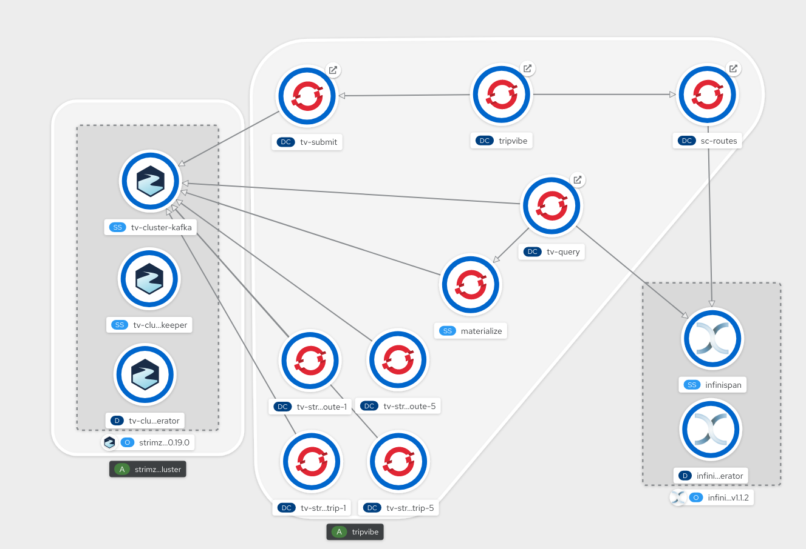
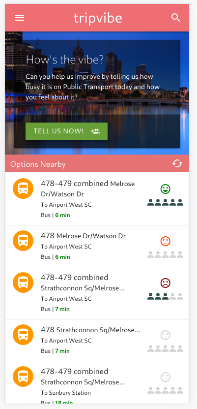
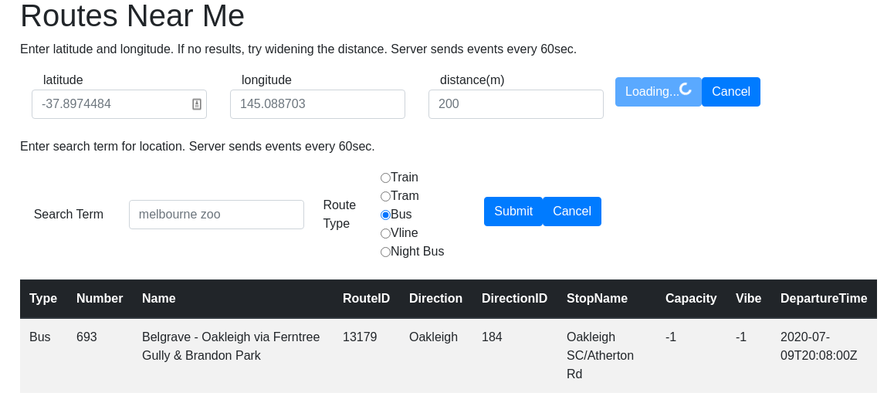
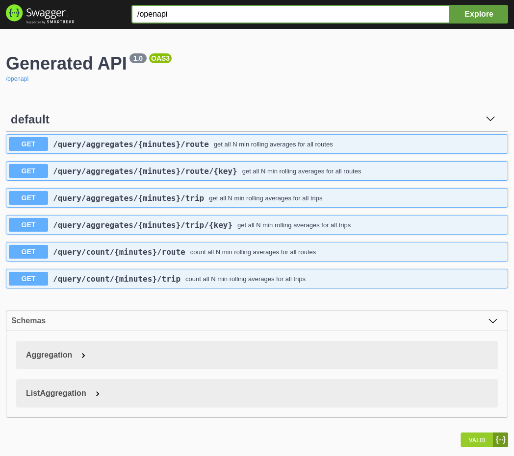

# tripvibe deployment



Tripvibe consists of the following services and applications:

- UI (angular, nginx) - https://github.com/rossbrigoli/tripvibe
- Submit API (quarkus java) - https://github.com/eformat/tv-submit
- Routes API (quarkus java) - https://github.com/eformat/sc-routes
- Query API (quarkus java) - https://github.com/eformat/tv-query
- Cache - https://infinispan.org
- Kafka Cluster - https://strimzi.io
- Kafka Streams - https://github.com/eformat/tv-streams
- Streaming Data Warehouse - https://materialize.io

## OpenShift Deployment

Note: this describes process for images tagged version :latest in quay.io

See version 1.0 of this document for previous versions.

### Jenkins

Each application contains a `Jenkinsfile` that can be used to build and deploy the applications. This includes the infrastructure components that are deployed as Operators. You will need `cluster-admin` type privileges to deploy these CRD's. See the `ocp` folder in API projects for yaml files.

Use a `multibranch pipeline` job to do this.

This method makes use of pre-deployed CI/CD tooling from the [Ubiquitous Journey](https://github.com/rht-labs/ubiquitous-journey)

### Manual CLI Method 

Tested using these prerequisites
- OpenShift 4.5+ cluster
- Strimzi 0.19 operator deployed at cluster scope
- Working dynamic storage class provisioner (gp2, RWO)
- PTV API developer user/password for https://timetableapi.ptv.vic.gov.au

Login to an OpenShift cluster as a user with `cluster-admin` priviliges.

Create a project
```bash
oc new-project tripvibe
```

Deploy Kafka cluster, tv-submit, materlialize
```bash
oc create -f https://raw.githubusercontent.com/eformat/tv-submit/master/ocp/openshift-deployment.yaml
```

Deploy Infinispan cluster, Infinispan 1.1.2 (stable) operator, infinispan 10.1.7.Final, deployed in namespace scope
```bash
oc create -f https://raw.githubusercontent.com/eformat/sc-routes/master/ocp/infinispan-operatorgroup.yaml
oc patch og sc-routes-dev --type='json' -p='[{"op": "replace", "path": "/spec/targetNamespaces", "value":["tripvibe"]}]'
oc create -f https://raw.githubusercontent.com/eformat/sc-routes/master/ocp/infinispan-subscription.yaml
oc create -f https://raw.githubusercontent.com/eformat/sc-routes/master/ocp/infinispan-cr.yaml
```

Wait for `infinispan-0` pod to start
```bash
oc wait pod/infinispan-0 --for=condition=Ready --timeout=300s
```

Generate secret for sc-routes. This contains PTV API user/password and Infinispan username/password:
```bash
cat <<EOF | oc apply -f -
apiVersion: "v1"
kind: "Secret"
metadata:
  name: "sc-routes"
data: 
  DEVID: "$(echo -n <PTV API Username> | base64)"
  APIKEY: "$(echo -n <PTV API Password> | base64)"
  INFINISPAN_REALM: "$(echo -n default | base64)"
  INFINISPAN_USER: "$(echo -n developer | base64)"
  INFINISPAN_PASSWORD: "$(echo -n $(oc exec infinispan-0 -- cat ./server/conf/users.properties | grep developer | awk -F'[=&]' '{print $2}') | base64)"
EOF
```

Deploy sc-routes
```bash
oc create -f https://raw.githubusercontent.com/eformat/sc-routes/master/ocp/openshift-deployment.yaml
```

Deploy tv-streams
```bash
oc create -f https://raw.githubusercontent.com/eformat/tv-streams/master/ocp/openshift-deployment.yaml
```

Deploy tv-query
```bash
oc create -f https://raw.githubusercontent.com/eformat/tv-query/master/ocp/openshift-deployment.yaml
```

Deploy tripvibe
````bash
oc create -f https://raw.githubusercontent.com/rossbrigoli/tripvibe/master/ocp/openshift-deployment.yaml
````

Patch Routes after `tripvibe` deploy
```bash
oc patch route/tripvibe-sc-routes --patch "{\"spec\":{\"host\": \"$(oc get route tripvibe -o custom-columns=ROUTE:.spec.host --no-headers)\"}}" --type=merge
oc patch route/tripvibe-tv-submit --patch "{\"spec\":{\"host\": \"$(oc get route tripvibe -o custom-columns=ROUTE:.spec.host --no-headers)\"}}" --type=merge
```

### Testing

`tripvibe` UI browse to route here:
```
oc get route tripvibe
```


`sc-routes` has a test page
```
oc get route sc-routes
```


Swagger available for `tv-query` and `sc-route` URL's, append `/swagger-ui`


### Tips'n'Tricks

If Outside Melbourne Victoria, set geoloc lat,long in chrome if you want results on the home page:
```bash
# Melbourne locations
-37.8143622,144.9675997          -- RedHat
-37.6905490,144.8687955          -- Airport
-37.8183886,144.9524854          -- Southern Cross Station
-37.8355672,145.0112232          -- Queen Victoria Markets
-37.8142819,144.9564245          -- Elizabeth & Queen St
-37.7552514,144.8363011          -- Watergardens
-37.799448,144.9462606           -- Donna
```

Connect to Materialize using sql and postgres client:
```bash
# connect to materlize using sql interface
oc port-forward materialize-0 6875:6875
psql -h localhost -p 6875 materialize
# query for all submissions
> select * from ROUTEALL;
```

To reset submission data you need to clear out Kafka topics and restart materialize:
```bash
# delete kafka topics
oc exec tv-cluster-kafka-0 -- /opt/kafka/bin/kafka-topics.sh --bootstrap-server tv-cluster-kafka-bootstrap:9092 --delete --topic tripvibe
oc exec tv-cluster-kafka-0 -- /opt/kafka/bin/kafka-topics.sh --bootstrap-server tv-cluster-kafka-bootstrap:9092 --delete --topic tripvibe2
# restart materlialize pods
oc delete pods materialize-0 materialize-1
``` 
